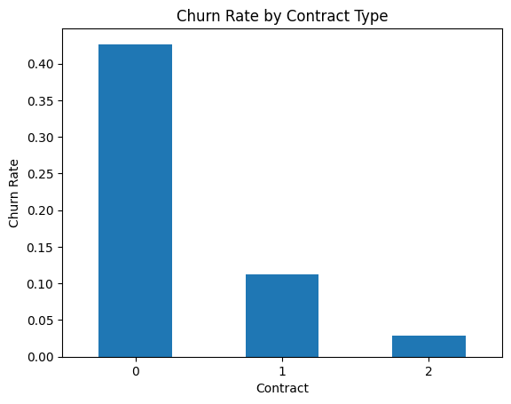
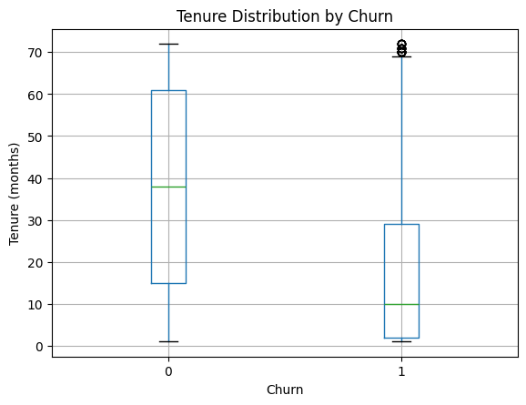
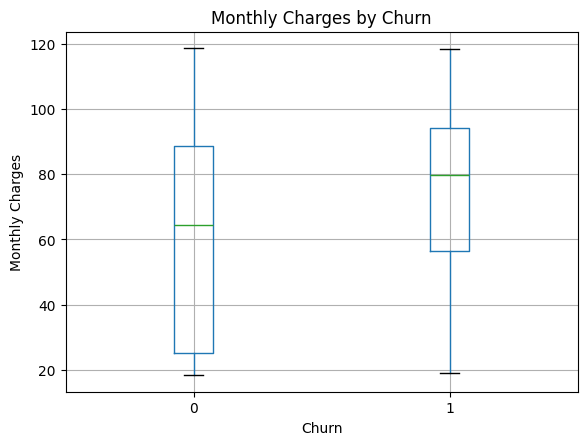
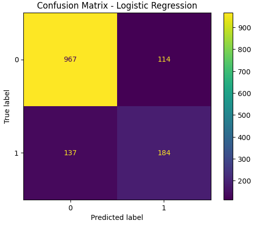
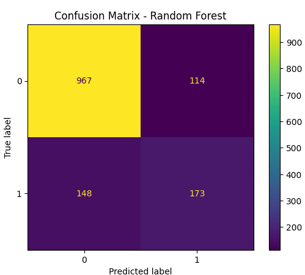
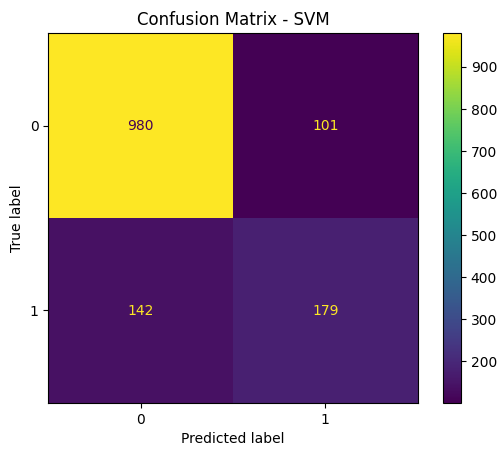

# why-customers-leave-ml
-Project Overview

This project aims to analyze customer behavior and predict churn using machine learning techniques.
By identifying key factors that influence customer churn, this project provides insights to support better customer retention strategies.

-Dataset

Source: Telco Customer Churn Dataset
Total records: ~7,000 customers

Features include:

Customer demographics

Service subscriptions

Billing information

Contract type

https://www.kaggle.com/datasets/blastchar/telco-customer-churn

-Data Preprocessing

To ensure data quality, several cleaning steps were performed:

Converted TotalCharges from object → numeric

Removed missing values (11 rows)

Removed duplicate data (22 rows)

Dropped irrelevant column (customerID)

Result: Clean dataset ready for analysis and modeling

-Exploratory Data Analysis (EDA)

EDA was conducted to understand patterns and relationships between features and churn.

a. Key Findings:
1. Contract Type vs Churn
Month-to-month → ~42.6% churn (highest)
1-year → ~11%
2-year → ~2.8% (lowest)

Customers without long-term commitment are more likely to churn.

2. Tenure vs Churn
Churn customers → ~18 months
Non-churn customers → ~37 months

New customers are more likely to leave.

3. Monthly Charges vs Churn
Churn customers → ~74.6
Non-churn → ~61.3

Higher cost is associated with higher churn risk.

-Machine Learning Models

Three models were used and compared:

1. Logistic Regression
2. Random Forest
3. Support Vector Machine (SVM)

a. Preprocessing for Models:

Label Encoding for categorical features

Train-test split (80:20)

Feature scaling (for LR & SVM)

Model Evaluation
1. Logistic Regression

Logistic Regression achieved an accuracy of 82%, with a churn recall of 57% and precision of 62%.

Interpretation:

The model performs well in identifying non-churn customers

It captures more churn cases compared to Random Forest

However, it still misses a portion of customers who actually churn

Conclusion:

Logistic Regression provides a good baseline model with balanced performance, but its ability to detect churn can still be improved.

2. Random Forest

Random Forest achieved an accuracy of 81%, with a churn recall of 54% and precision of 60%.

Interpretation:

The model slightly underperforms compared to others
It struggles more in identifying churn customers
However, it is useful for understanding feature importance

Conclusion:
While Random Forest is powerful, in this case it does not outperform simpler models and has lower recall for churn prediction.

3. Support Vector Machine (SVM)

SVM achieved the highest accuracy of 83%, with a churn recall of 56% and precision of 64%.

Interpretation:

Best overall model in terms of accuracy
Higher precision indicates fewer false positives
Still misses some churn cases (moderate recall)

Conclusion:
SVM provides the best overall performance among the tested models, making it the most suitable model for this task.
